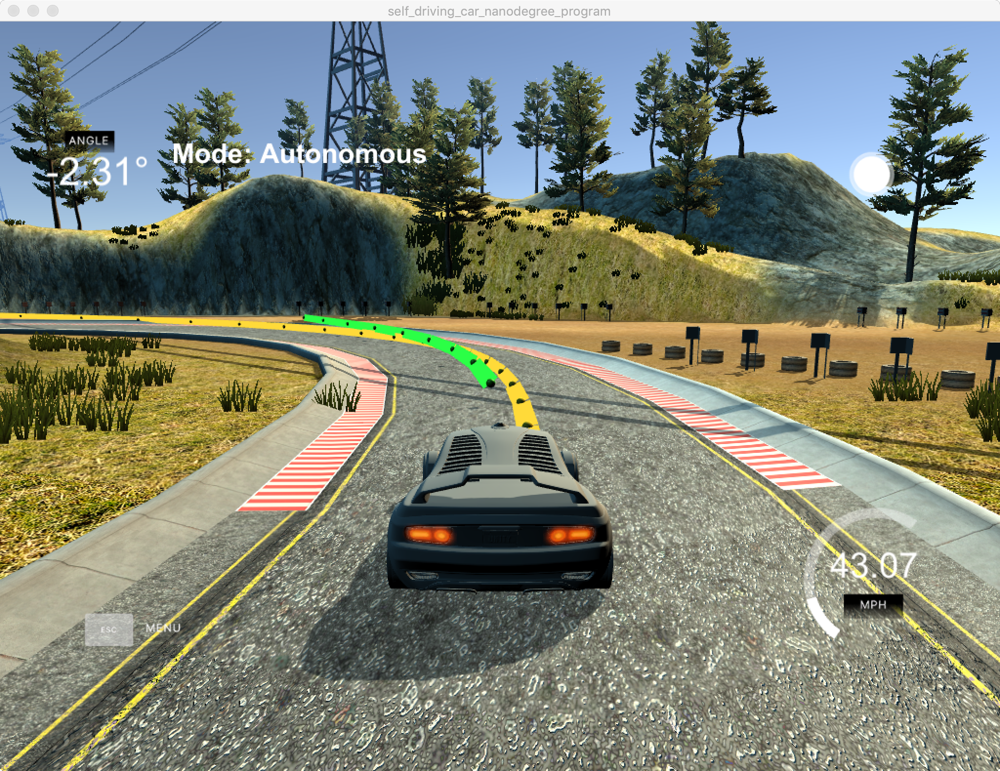

# MPC Controller Project

Self-Driving Car Engineer Nanodegree Program

---

## Introductions

This project is the 5th project in Term 2 of Udacity Self-Driving Car Engineer Nanodegree Program. The goal of this project is to implement Model Predictive Control to drive the car around the track. And since there are no cross error provided, it should also be calculated. Additionally, there's a 100 milliseconds latency between actuations commands on top of the connection latency, which should also take into consideration.

## Basic Build Instructions

1. Clone this repo.
2. Make a build directory: `mkdir build && cd build`
3. Compile: `cmake .. && make`
4. Run it: `./mpc`.
5. Run the Term2 Simulator and visualize the result. 

Tips for seeting up the environment can be found [here](https://classroom.udacity.com/nanodegrees/nd013/parts/40f38239-66b6-46ec-ae68-03afd8a601c8/modules/0949fca6-b379-42af-a919-ee50aa304e6a/lessons/f758c44c-5e40-4e01-93b5-1a82aa4e044f/concepts/7d235103-5c4d-4001-a227-5ad2ac43bfff)

## Tips

1. The MPC is recommended to be tested on examples to see if implementation behaves as desired. One possible example is the vehicle offset of a straight line (reference). If the MPC implementation is correct, it tracks the reference line after some timesteps(not too many).
2. The `lake_track_waypoints.csv` file has waypoints of the lake track. This could fit polynomials and points and see of how well your model tracks curve. NOTE: This file might be not completely in sync with the simulator so your solution should NOT depend on it.
3. For visualization this C++ [matplotlib wrapper](https://github.com/lava/matplotlib-cpp) could be helpful.)  
4. Tips for setting up your environment are available [here](https://classroom.udacity.com/nanodegrees/nd013/parts/40f38239-66b6-46ec-ae68-03afd8a601c8/modules/0949fca6-b379-42af-a919-ee50aa304e6a/lessons/f758c44c-5e40-4e01-93b5-1a82aa4e044f/concepts/23d376c7-0195-4276-bdf0-e02f1f3c665d)

## What is MPC Controller

Model predictive control (MPC) is an advanced method of process control that is used to control a process while satisfying a set of constraints. In MPC at each
sampling time step, starting at the current state, an openloop optimal control problem is solved over a finite horizon. The optimal command signal is applied to the process only during the following sampling interval. At the next time step a new optimal control problem based on new measurements is solved over a shifted horizon. The optimal solution relies on a dynamic model of the process, respects input and output constraints, and minimizes a performance index. 

## Theory behind MPC  

From the Wiki: 
> MPC is based on iterative, finite-horizon optimization of a plant model. At time $t$ the current plant state is sampled and a cost minimizing control strategy is computed (via a numerical minimization algorithm) for a relatively short time horizon in the future: $[t,t+T]$ $[t,t+T]$. Specifically, an online or on-the-fly calculation is used to explore state trajectories that emanate from the current state and find (via the solution of Euler–Lagrange equations) a cost-minimizing control strategy until time $t+T$. Only the first step of the control strategy is implemented, then the plant state is sampled again and the calculations are repeated starting from the new current state, yielding a new control and new predicted state path. The prediction horizon keeps being shifted forward and for this reason MPC is also called receding horizon control. Although this approach is not optimal, in practice it has given very good results. Much academic research has been done to find fast methods of solution of Euler–Lagrange type equations, to understand the global stability properties of MPC's local optimization, and in general to improve the MPC method. To some extent the theoreticians have been trying to catch up with the control engineers when it comes to MPC.

## The model

The nonlinear continuous time equations that describe a kinematic bicycle model in an inertial frame are: 

$$x[t] = x[t-1] + v[t-1]*cos(psi[t-1])*dt$$  
$$y[t] = y[t-1] + v[t-1]*sin(psi[t-1])*dt$$  
$$psi[t] = psi[t-1] + v[t-1] / Lf*delta[t-1]*dt$$  
$$v[t] = v[t-1] + a[t-1] * dt$$  
$$cte[t] = f(x[t-1]) - y[t-1] + v[t-1]*sin(epsi[t-1]) * dt$$  
$$epsi[t] = psi[t] - psides[t-1] + v[t-1] * delta[t-1]/Lf*dt$$  

where $x$ and $y$ are the coordinates of the center of mass gravity of the vehicle; $psi$ is the heading angle of the vehicle; $v$ is the speed of the vehicle; $cte$ represents the cross track error and $epsi$ represents the heading angle error. 

In addition, $Lf$ is the distance between the car of mass and the front wheels (the value is 2.67 provided by the course). The other two values are the model output, where $a$ is the acceleration(throttle) of the vehicle and $delta# is the steering angle of the vehicle.  

## How to deal with the latency

To handle to latency, the state values are calculated using the model and the latency, which means the state values should be the values after latency. This is implemented in `main.cpp` from line 131 to 147. 

I would say the result seems good at moment. The project can compile and run without errors, and the vehicle can drive along the track without rushing out of the road.  
Here is a screenshot of the result.

